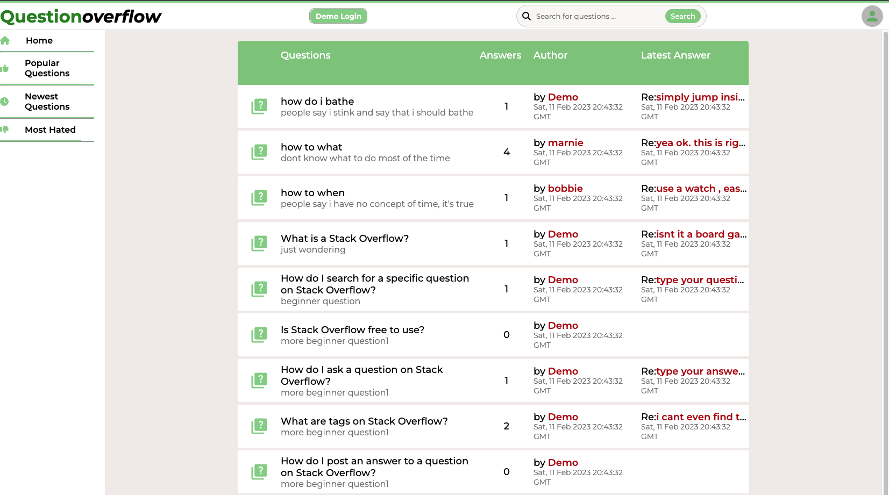
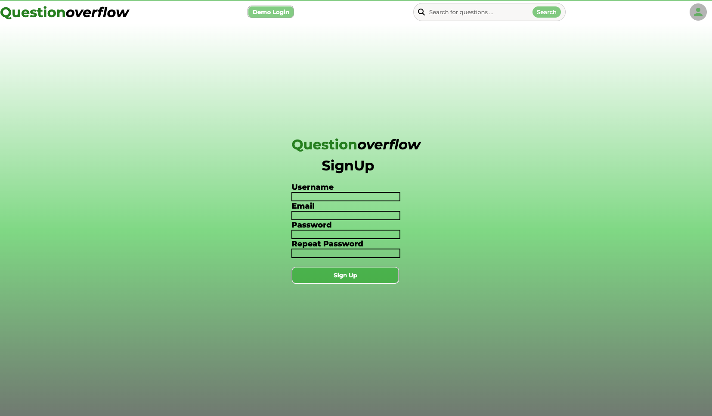
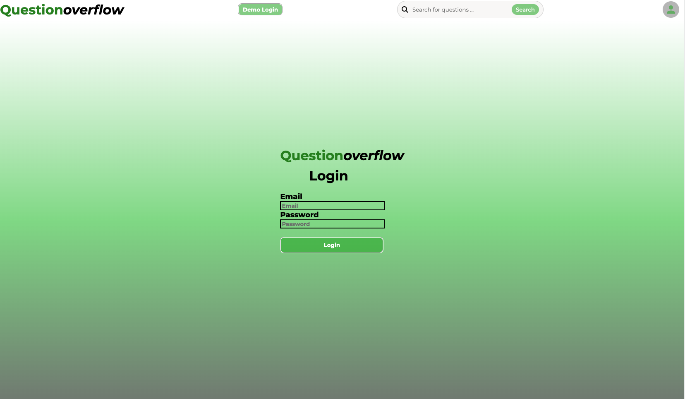
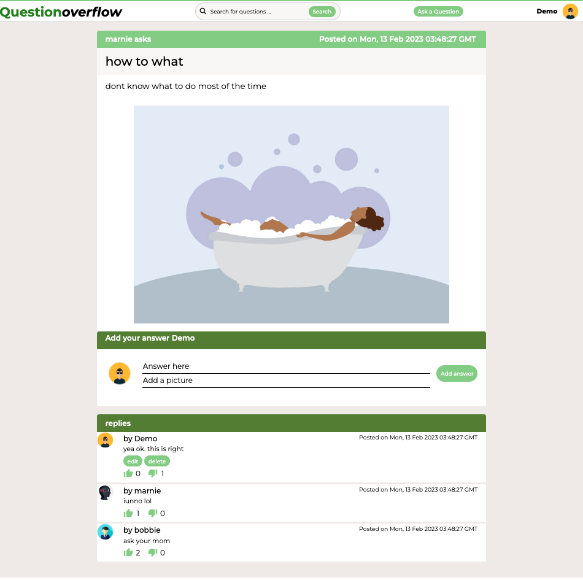
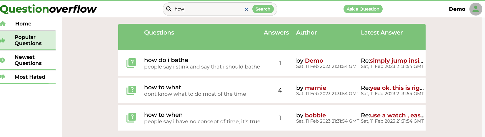

# Question OverFlow

## Welcome!

Question Overflow, a StackOverflow clone, is a website for users to share brief questions, engage in light discussion, where they and users can vote on posted answers.

# Images

## Homepage

## Sign Up

## Log In

## Question Page

## Search Feature


# Getting started
1. Clone this repository

2. Install backend dependencies

      ```bash
      pipenv install
      ```

3. Create a **.env** file based on the example with proper settings for your
   development environment

4. Make sure the SQLite3 database connection URL is in the **.env** file

5. This starter organizes all tables inside the `flask_schema` schema, defined
   by the `SCHEMA` environment variable.  Replace the value for
   `SCHEMA` with a unique name, **making sure you use the snake_case
   convention**.

6. Get into your pipenv, migrate your database, seed your database, and run your Flask app with:

   ```bash
   pipenv shell
   ```

   ```bash
   flask db upgrade
   ```

   ```bash
   flask seed all
   ```

   ```bash
   flask run
   ```

7. To run the React App in development, open another terminal window and cd into **react-app**
8. Install frontend dependencies.
```bash
npm install
```

9. While in development, run this application from this location using
```bash
npm start
````

### Notes
   - No environment variables are needed to run this application in development, but be sure to set the REACT_APP_BASE_URL environment variable when you deploy!

   - This app will be automatically built when you push to your main branch on Github.

   - This project was bootstrapped with [Create React App](https://github.com/facebook/create-react-app).


### This project uses the following technologies
### Frontend
* Javascript
* React
* Redux
* FontAwesome
### Backend
* Python
* Flask
* SQLAlchemy
* Alembic
* SQLite3 (development)
* PostgreSQL (production)

# CRUD Features

## User
Allows you to:
   - Log in
   - Sign up
   - Explore restaurants
   - Use the DEMO USER login

## Questions
   - All users can view a sampling of the most recent questions.

As a non-logged in user you can:
   - Explore Question Threads
   - View Replies and Reactions

As a logged in user you can:
   - Post questions
   - Edit and Delete your own questions

## Answers
   - All users can view a sampling of the most recent answers to questions.

A logged in user can:
 - Post answers to questions
 - Edit and delete their own answers
 - Change upcoming Reservations
 - Cancel a Reservation

 ## 3. Search for Questions

- All users can search for questions

## Reactions
A logged in user can:
 - Up-vote and down-vote an answer
 - Remove their own reaction
 - Update their reaction


# Future Features

## This clone is a work in progress, these features will be available in the future...

- ## Popular Questions Page
   -Dedicated to the Questions with the most replies
- ## Newest Questions Page
   -See the latest posted Questions
- ## Most Hated Page
   -Take a trip back to Middle School and explore the most disliked Answers

   -80s cliche bad egg graffitii wall included
- ## Explore Category Page
   -Questions will be organized by tags which all users can use to explore categories
